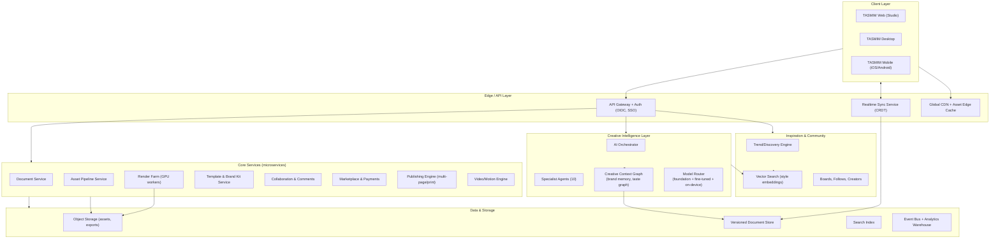

# TASMIM Master Product Architecture

> Phase 2 — Product Architecture & World-Class Competitive Blueprint
> Companion to [`TASMIM-EDITORIAL-BIBLE.md`](../TASMIM-EDITORIAL-BIBLE.md)

This document defines how TASMIM is actually built: the system architecture, the product ecosystem it ships as, and the seven architectural layers (desktop, mobile, cloud, AI, offline) that make the vision in the Editorial Bible real.

---

## 1. System Architecture — Overview

TASMIM is architected as a **local-first, AI-native creative platform**: every client holds a full working copy of the document and can create, edit, and render without the network; the cloud exists to synchronize, scale rendering, run heavy AI, and power discovery. This is the same philosophical bet Figma made for real-time collaboration and Notion made for offline note-taking, extended to a full creative suite plus a proprietary AI layer.

**Guiding principles:**

1. **Local-first, cloud-augmented.** The document is a CRDT that lives on-device first. Cloud sync is a fast path, not a dependency.
2. **AI as a service mesh, not a bolt-on.** The Creative Intelligence Layer is a first-class peer to the Core Services, not a feature flag inside the editor.
3. **One rendering core, every surface.** Web, desktop, and mobile share a single high-performance rendering engine (compiled to WebGPU/WebGL, native GPU, and WASM) so a design looks and behaves identically everywhere — the single biggest technical lesson from Figma's multi-year investment in a custom C++ rendering engine.
4. **Composable services over a monolith.** Publishing (books/print), Video (motion), and Marketplace are independently scalable services so a viral spike in one (e.g., social templates) never degrades the design editor.

---

## 2. Product Ecosystem

TASMIM ships as one identity with distinct, purpose-built surfaces — closer to how Adobe Creative Cloud federates apps around a shared Libraries/Fonts backbone than how Canva ships one undifferentiated web app:

| Product | Purpose | Primary User |
|---|---|---|
| **TASMIM Studio** | Core graphic design canvas (web) | Everyone |
| **TASMIM Desktop** | Offline-capable, GPU-accelerated pro editing | Professionals, agencies |
| **TASMIM Mobile** | Full-parity creation and review on the go | Everyone, especially emerging markets |
| **TASMIM Presentations** | AI decks, interactive/animated slides | Business, education |
| **TASMIM Publishing** | Books, journals, magazines, reports | Publishers, authors, universities |
| **TASMIM Video** | Motion graphics, reels, ads | Creators, marketers |
| **TASMIM Boards** | Pinterest-class inspiration & discovery | Everyone (top-of-funnel) |
| **TASMIM Marketplace** | Buy/sell templates, fonts, kits | Creators, agencies |
| **TASMIM Enterprise** | Governance, SSO, brand control, approvals | Large organizations |
| **TASMIM Islamic Suite** | Arabic typography, calligraphy, Mushaf, da'wah media | Islamic institutions, publishers, creators |
| **TASMIM API/SDK** | Programmatic design generation, plugin ecosystem | Developers, integrators |

All surfaces read and write the same document model and share one identity, one asset library, one brand kit system, and one AI context — a design started on mobile finishes on desktop with zero translation loss.

---

## 3. Desktop Architecture

**Goals:** professional-grade performance (Affinity/CorelDRAW-class raster+vector precision), true offline capability, and native OS integration — without the bloat and slow startup that plague Electron-based tools.

- **Shell:** Rust-based native shell (Tauri-style) rather than a full Chromium-per-window Electron app — smaller binary, lower memory, faster cold start.
- **Rendering core:** Shared C++/Rust rendering engine compiled for native GPU APIs (Metal on macOS, DirectX/Vulkan on Windows) — the same core that compiles to WebGPU for the browser, guaranteeing pixel-identical output across platforms.
- **Document engine:** CRDT-based document (see §7, Offline Architecture) stored locally as a single portable file bundle (`.tasmim`) plus a background sync daemon.
- **Color & print fidelity:** Full ICC color management, CMYK preview/soft-proofing, and high-resolution (300+ DPI) export pipeline — a category Canva and Adobe Express intentionally under-serve and where Affinity/CorelDRAW still win today.
- **Plugin architecture:** Sandboxed WASM plugin runtime with a typed API surface (documents, selection, AI hooks, render hooks) — enabling a third-party ecosystem without native-code security risk.
- **Performance budget:** sub-200ms cold start, sub-16ms frame time (60fps) on documents with 10,000+ objects, achieved via a scene-graph with dirty-rectangle re-rendering and GPU-instanced shape batching.

---

## 4. Mobile Architecture

**Goals:** mobile is not a companion app — it must reach full feature parity with desktop, per the Editorial Bible's mandate (§12).

- **Native shells:** Swift/SwiftUI (iOS) and Kotlin/Compose (Android) wrapping the **same shared C++/Rust rendering core** used on desktop and web (compiled via WASM for web, native ABI for mobile) — one engine, three skins, exactly the model Figma pioneered for cross-platform parity.
- **Touch-first interaction layer:** a distinct gesture and toolbar system optimized for touch (not a shrunk desktop UI) — pinch/rotate/multi-touch object manipulation, palm-rejection for the calligraphy and drawing tools, haptic feedback on snap/align.
- **On-device AI:** a distilled, quantized subset of the Creative Intelligence models runs on-device (NPU-accelerated on modern iPhones/Android flagships) for latency-sensitive actions — smart crop, auto-layout suggestions, background removal — falling back to cloud inference on older hardware.
- **Sync engine:** the same CRDT sync protocol as desktop, tuned for intermittent connectivity and metered/low-bandwidth networks — critical for TASMIM's emerging-market and MENA/South-Asia user base.
- **Camera-native capture:** first-class scan-to-design (document scanning, calligraphy digitization, whiteboard capture) as a mobile-exclusive creative entry point.

---

## 5. Cloud Architecture

- **Multi-region microservices** (documents, assets, render, publishing, video, marketplace, collaboration) deployed across at least three geographic regions at GA, with a fourth region prioritized for the Middle East/GCC given the Islamic Suite's core audience and data-residency expectations (e.g., Saudi PDPL).
- **Realtime collaboration servers** run a CRDT-based (e.g., Automerge/Yjs-family) sync protocol over WebSocket/WebTransport, horizontally sharded by document, with presence and cursor state as an ephemeral side-channel (not persisted in the document history).
- **GPU render farm** for expensive operations the client shouldn't do itself: 4K/8K video export, print-resolution rasterization, batch marketplace thumbnail generation, and AI image synthesis — autoscaled, spot-instance-friendly, and decoupled from the interactive editing path so a batch export job never stalls a live editing session.
- **Event-driven backbone** (Kafka-class event bus) connects every service for analytics, AI training-signal collection (with consent), billing metering, and the Smart Design Coach's asynchronous review pipeline.
- **Storage tiers:** hot object storage for active assets, cold storage for version history and marketplace archives, and a versioned document store that keeps the full CRDT operation log (enabling perfect undo history and time-travel, à la Figma's history browser).
- **Search & discovery infrastructure:** hybrid keyword + vector search (embeddings for color, style, layout, and semantic content) powering both in-app asset search and the Inspiration Ecosystem's trend discovery.

---

## 6. AI Architecture

TASMIM's AI is not "one model behind a chat box" — it is an **orchestrated mesh of specialist agents** sitting on a shared memory layer. Full agent-by-agent detail lives in [`04-creative-intelligence-engine.md`](./04-creative-intelligence-engine.md); this section covers the platform substrate underneath them.

- **Model Router:** classifies each request and routes it to the cheapest model capable of handling it — on-device model → fast fine-tuned specialist → large foundation model — to control latency and inference cost at scale. This tiering is a core cost-control necessity flagged in the self-review (§8 of the roadmap document).
- **Creative Context Graph:** a persistent, per-user and per-brand memory graph (brand colors, type pairing history, tone of voice, past approvals/rejections, saved inspiration) that every agent reads from and writes to — this is what lets TASMIM "learn the user" rather than treat every prompt as stateless, directly satisfying the Editorial Bible's "Intelligence Over Complexity" principle.
- **Retrieval layer:** Retrieval-Augmented Generation over the user's own boards/brand kit plus a licensed, rights-cleared stock/style corpus — never raw scraped third-party content — feeding both generation and the Inspiration Ecosystem.
- **Safety & provenance layer:** every AI-generated or AI-assisted element is tagged with provenance metadata (model, prompt lineage, source references) for transparency, copyright defensibility, and the "Design Provenance Ledger" concept explored in §8 of the future-facing document. Outputs pass through similarity/perceptual-hash checks against copyrighted and trademarked reference sets before export at commercial scale.
- **Feedback loop:** the Smart Design Coach's critiques and user accept/reject actions on AI suggestions become first-party training signal (opt-in), continuously improving the specialist agents without depending solely on third-party foundation model updates.

---

## 7. Offline Architecture

Offline is not "works when disconnected" as an afterthought — it is the default state the online experience upgrades from.

- **CRDT document core:** every document is a Conflict-free Replicated Data Type. Edits apply locally instantly (zero perceived latency) and merge automatically when connectivity returns, with no lost work and no manual conflict resolution for the common case.
- **Local asset cache:** fonts, brand kit assets, recently used images/templates, and the active document's dependency graph are cached on-device so a user can keep working through a subway commute or a low-connectivity region — a deliberate bet given TASMIM's MENA/South-Asia-weighted audience.
- **Deferred AI:** cloud-dependent AI calls queue locally and execute on reconnect; latency-tolerant on-device models (see §4) cover the most common actions so "no signal" never means "no AI."
- **Background sync daemon:** reconciles the local CRDT log with the cloud document store opportunistically, prioritizing small metadata deltas over full asset re-upload, and resumes interrupted large-asset transfers (print-resolution exports, video renders) rather than restarting them.
- **Conflict transparency:** in the rare case of a true semantic conflict (e.g., two collaborators redesign the same element offline), TASMIM surfaces both versions side-by-side for human resolution rather than silently picking one — trust over cleverness.

---

## Cross-Cutting Concern: One Document Model

The single architectural decision that makes the rest of this document coherent: **there is exactly one document format, one rendering engine, and one AI context graph across every product surface and every platform.** Competing platforms fragment badly here — Adobe's document formats differ across apps, Canva's mobile app has historically lagged web in feature parity, and most "AI design tools" bolt generation onto an unrelated editor. TASMIM's architecture is designed from day one to avoid that fragmentation, because it is far cheaper to prevent than to retrofit.
