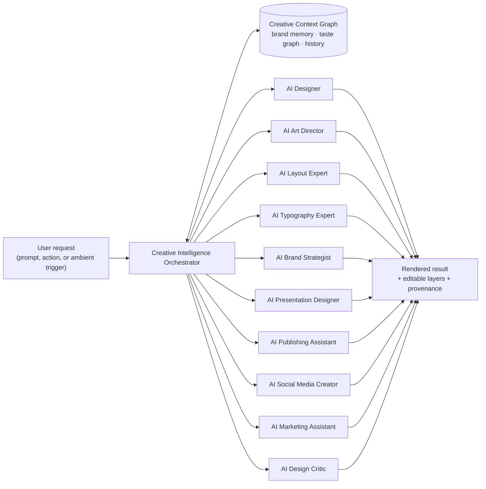

# TASMIM Creative Intelligence Engine

> The proprietary AI ecosystem behind every surface of TASMIM. Ten specialist agents, one shared memory, one orchestrator.

## Architecture Overview

The **Orchestrator** is not a chatbot front-end; it's a routing and composition layer. A single user request ("Create a premium Saudi Vision-style annual report") typically fans out to several agents at once — AI Art Director sets the visual tone, AI Layout Expert builds the grid, AI Typography Expert selects and pairs type, AI Publishing Assistant assembles the multi-page structure — and the Orchestrator merges their outputs into one coherent, editable document rather than presenting them as separate suggestions.

The **Creative Context Graph** (introduced in Master Architecture §6) is the shared memory every agent reads and writes: brand colors and type history, past accepted/rejected suggestions, saved inspiration boards, organizational style guides. This is what separates TASMIM's agents from a stateless prompt-to-image call.

---

## 1. AI Designer
**Role:** the generalist entry point — turns a plain-language brief into a complete first draft.

- **Inputs:** free-text prompt, optional reference image/logo, optional selected inspiration board.
- **Capabilities:** intent classification (poster vs. deck vs. social post vs. report), draft composition by delegating to specialist agents below, and presenting 2–3 distinct directions rather than one.
- **Workflow example:** "Design an Islamic conference flyer" → classifies as single-page graphic → pulls brand context if available → invokes AI Art Director for mood + AI Layout Expert for structure + AI Typography Expert for type, optionally routing to the Islamic Creative Suite's pattern/calligraphy tools → returns 3 live, editable drafts in under 15 seconds.
- **Architecture note:** thin orchestration wrapper over the other nine agents plus a fast draft-composition model; deliberately not a single monolithic model, so any specialist can be upgraded independently.

## 2. AI Art Director
**Role:** sets and enforces visual tone — mood, color story, imagery style — across a design or a whole project.

- **Capabilities:** mood-board-to-palette extraction, style transfer guidance for imagery, cross-asset visual consistency checks (does this Instagram post still "feel like" the brand's annual report?).
- **Workflow example:** given a saved TASMIM Boards moodboard, extracts a color system and imagery mood descriptor, then hands both to AI Layout Expert and AI Typography Expert as constraints.
- **Architecture note:** consumes the Vector Search / style-embedding infrastructure shared with the Inspiration Ecosystem ([`05-inspiration-ecosystem.md`](./05-inspiration-ecosystem.md)) — the same embeddings power "find me more like this" in Boards and "make this on-brand" in the editor.

## 3. AI Layout Expert
**Role:** grid, composition, and spatial hierarchy.

- **Capabilities:** auto-layout generation from content (given text + images, produce a balanced composition), responsive re-flow across formats (same content, resized for A4 print vs. Instagram square vs. presentation slide), alignment/spacing correction.
- **Workflow example:** user drops six photos and a headline onto a blank canvas; AI Layout Expert proposes a balanced grid respecting visual weight and reading order, live-adjustable by drag.
- **Architecture note:** combines a constraint-solver (deterministic, for alignment/spacing/grid math — not generative, because layout math should be exact) with a learned composition-scoring model trained on design-quality signals from the Smart Design Coach's feedback loop.

## 4. AI Typography Expert
**Role:** type selection, pairing, and fine-grain typesetting.

- **Capabilities:** font pairing recommendations constrained by brand kit, automatic kerning/tracking/leading correction, multi-script typesetting (critical for Arabic/Latin bilingual work — see Islamic Creative Suite), readability scoring by context (billboard vs. body text).
- **Workflow example:** flags a heading set in a display face at body-text size as a hierarchy problem, proposes a corrected scale, and — for Arabic content — ensures correct contextual letterform shaping and kashida justification rather than naive Latin-style letter-spacing.
- **Architecture note:** deep integration with the Arabic Typography Engine ([`06-islamic-creative-suite.md`](./06-islamic-creative-suite.md)) rather than treating RTL scripts as a font-swap afterthought.

## 5. AI Brand Strategist
**Role:** guards and evolves brand identity across every asset an organization produces.

- **Capabilities:** brand kit generation from a logo/brief, consistency auditing across a team's output, "what would our brand do" guidance when a new format is needed (e.g., a brand has never made a Hijri calendar graphic before — the Brand Strategist proposes an extension consistent with existing identity).
- **Workflow example:** Enterprise Mode team member drafts a social post; before publish, AI Brand Strategist checks it against the org's locked brand kit and flags an off-palette color, offering the corrected value inline.
- **Architecture note:** the primary write-path into the Creative Context Graph's brand-memory partition; other agents read brand constraints from here rather than each re-deriving them.

## 6. AI Presentation Designer
**Role:** decks — from outline to fully designed, animated slides.

- **Capabilities:** outline-to-deck generation, per-slide layout variation (avoids the "every slide looks identical" template trap), speaker-note-aware pacing suggestions, animated/interactive slide behavior (Editorial Bible §7 Presentation Studio).
- **Workflow example:** user pastes a report outline; AI Presentation Designer produces a full deck with varied but consistent slide layouts, delegating typography and layout math to Agents 3–4 and brand compliance to Agent 5.
- **Architecture note:** maintains slide-to-slide state (previous layout, pacing, information density) so output doesn't repeat the same template mechanically — a common failure mode in current "AI slide" tools.

## 7. AI Publishing Assistant
**Role:** long-form, multi-page publishing — books, journals, magazines, reports.

- **Capabilities:** master-page and style-sheet management, automatic pagination and reflow, table-of-contents/index generation, print-ready CMYK preflight checks.
- **Workflow example:** "Create a luxury school prospectus" → assembles a multi-page master-page structure, populates section templates, and runs a preflight check (bleed, resolution, color mode) before export.
- **Architecture note:** the agent most tightly coupled to the Publishing Engine core service (Master Architecture §1/§5) rather than the interactive canvas alone, since long documents require deterministic pagination logic beyond what a generative model should own.

## 8. AI Social Media Creator
**Role:** high-velocity, multi-format social content.

- **Capabilities:** one-brief-to-many-formats generation (a single campaign brief becomes a Story, a feed post, a Reel cover, and a carousel, each correctly sized and paced for its platform), trend-aware suggestions sourced from the Inspiration Ecosystem's trend discovery, caption/hashtag drafting.
- **Workflow example:** given a product photo and a campaign message, produces a platform-correct set of assets in one pass, each independently editable.
- **Architecture note:** the primary consumer of the Trend Discovery Engine ([`05-inspiration-ecosystem.md`](./05-inspiration-ecosystem.md)) for timely, not-generic output.

## 9. AI Marketing Assistant
**Role:** connects design output to marketing intent and performance.

- **Capabilities:** copywriting assistance tuned to brand voice, campaign-consistency checks across assets, A/B variant generation for creative testing, basic performance-informed suggestions where analytics integrations are connected (e.g., "your last three posts with high-contrast headlines outperformed low-contrast ones").
- **Workflow example:** generates three headline variants for a single ad creative, each within brand voice constraints set by the Brand Strategist.
- **Architecture note:** the one agent designed to accept external signal (connected ad-platform or analytics data) as an input, gated behind explicit user consent and clearly separated from the on-platform design signals used elsewhere.

## 10. AI Design Critic
**Role:** the Smart Design Coach made concrete (Editorial Bible §8) — continuous, ambient review of every design.

- **Capabilities:** contrast/accessibility checking, alignment and spacing consistency review, visual hierarchy assessment, brand-compliance flagging, plain-language explanations ("This heading is too small," "Contrast needs improvement").
- **Workflow example:** runs asynchronously in the background as a user edits (via the event bus, Master Architecture §5), surfacing non-blocking suggestions in a dedicated review rail rather than interrupting flow — "Grammarly for design."
- **Architecture note:** the primary consumer of the Smart Design Coach's own historical accept/reject data — a feedback loop that improves the Layout Expert and Typography Expert's base scoring models over time, making critique and generation mutually reinforcing rather than separate systems.

---

## Shared Workflow Pattern

Regardless of which agent(s) a request engages, every Creative Intelligence interaction follows the same contract:

1. **Context read:** Orchestrator pulls relevant Creative Context Graph state (brand kit, history, active inspiration).
2. **Fan-out:** relevant specialists execute, in parallel where independent (e.g., Typography and Layout can run concurrently; Brand Strategist compliance check runs after both).
3. **Merge:** Orchestrator composes outputs into one coherent, fully editable result — never a set of disconnected suggestions the user must manually reconcile.
4. **Provenance tagging:** every generated or modified element is tagged per the Master Architecture's safety/provenance layer (§6).
5. **Context write:** accepted/rejected outcomes update the Creative Context Graph, so the next request — by this user or, in aggregate and anonymized form, the base models themselves — is better informed.

This shared contract is what makes the ten agents feel like *one* intelligent collaborator rather than ten separate bots — directly serving the Editorial Bible's mandate that "AI must amplify creativity, not replace it," and that TASMIM should "feel like a world-class creative partner."
