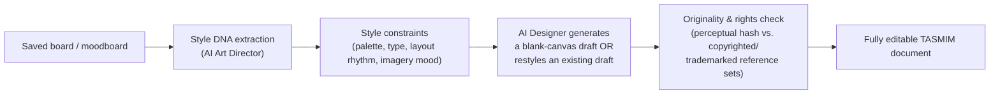

# TASMIM Inspiration Ecosystem ("TASMIM Boards")

> A Pinterest-class discovery system — but wired directly into a working design engine, so inspiration never dead-ends at a screenshot.

## Why This Is TASMIM's Sharpest Wedge

Pinterest owns taste and discovery at massive scale but has no editor: saving a pin is the end of the workflow, not the beginning of one. Every design tool (Canva, Figma, Adobe Express) has the opposite problem — a capable editor with no real discovery layer, so "inspiration" means a folder of screenshots a user must manually re-interpret by eye. No competitor has closed this loop. TASMIM Boards is built specifically to close it — see the Feature Matrix, §E, for the head-to-head gap.

---

## 1. Inspiration Boards

- Freeform, Pinterest-familiar collection surfaces: users save designs, photos, color palettes, and typography samples from anywhere in TASMIM (Marketplace, other users' public work, AI-generated exploration) or imported from outside via a browser extension/share-sheet.
- Boards are **structured, not just visual** — every saved item is automatically embedded (color, style, layout, semantic content) via the same Vector Search infrastructure used across the platform (Master Architecture §5), so a board is queryable ("show me the more minimal pieces in this board") not just scrollable.

## 2. Moodboards

- A moodboard is a board with an explicit purpose: producing a **Style DNA** — an extracted, structured summary of color palette, typography mood (serif/sans, weight, size rhythm), imagery tone, and layout density — computed by the AI Art Director (see [`04-creative-intelligence-engine.md`](./04-creative-intelligence-engine.md)) from whatever a user has collected.
- Style DNA is the artifact that makes Inspiration-to-Design (§8 below) possible — it's a machine-usable brief, not just a human mood reference.

## 3. Trend Discovery

- A recommendation feed built on aggregated, privacy-respecting engagement signals (saves, remixes, dwell time) plus explicit editorial curation — avoiding a pure engagement-optimization feed that would drift toward generic virality rather than genuine design quality.
- Trend clusters are surfaced by *category and region* (e.g., "Ramadan campaign design, Gulf region, this month") rather than one undifferentiated global feed — directly useful to the AI Social Media Creator agent and to TASMIM's MENA-weighted audience.
- Trend data flows both ways: it informs the discovery feed *and* feeds the AI Social Media Creator's "trend-aware suggestions" (Creative Intelligence Engine §8).

## 4. Creative Communities

- Follow designers, brands, and topical communities (e.g., "Islamic Publishing," "Presentation Design," "Motion Graphics").
- Remixing is a first-class, attributed action: starting from someone else's public design credits the original creator automatically and, where the original is a paid template, routes through the Marketplace's licensing/payment flow rather than silently copying.
- Critique and comments on public work are structured around the same Design Critic categories used privately (contrast, hierarchy, alignment) — turning community feedback into the same vocabulary the AI Design Critic uses, so human and AI feedback reinforce each other rather than talking past one another.

## 5. Creator Profiles

- Every creator has a portfolio surface unifying their public boards, published templates/assets (Marketplace), and remix lineage (who built on their work, and what they built on).
- **Verified Creator** status (identity + quality bar) unlocks Marketplace monetization and increased discovery weight — a trust signal the raw engagement feed alone shouldn't determine.

## 6. Smart Collections

- Auto-generated, continuously updating collections a user never manually curated: "Your saved high-contrast layouts," "Palettes you keep coming back to," "Arabic calligraphy you've saved this year" — derived entirely from the embedding/Style-DNA infrastructure above, requiring zero manual tagging.
- Smart Collections are also how the Creative Context Graph (Master Architecture §6) gets much of its signal about a user's taste without requiring explicit preference surveys.

## 7. AI-Generated Inspiration

- Beyond surfacing what a user already saved, TASMIM can generate **novel** reference material in a requested style — "more like this, but fresher" — using the same Model Router and safety/provenance layer as generative design output (Master Architecture §6).
- AI-generated inspiration is clearly labeled as such in the feed (provenance transparency, per the Experience Design System §6) — it augments human-made inspiration, it never silently passes as it.

## 8. Inspiration-to-Design Conversion

The core loop that makes this ecosystem more than a mood board app:

- **Style DNA, not pixel copying.** The pipeline never reproduces a saved reference directly — it extracts an abstracted style signature (palette relationships, typographic rhythm, compositional density) and generates fresh layouts constrained by that signature. This is both a creative-quality decision (genuinely new work, not a knockoff) and a legal-safety decision.
- **Originality and rights safeguards.** Every generated result is checked via perceptual-hashing and similarity scoring against copyrighted/trademarked reference sets before it's presented as a finished draft, consistent with the Master Architecture's safety/provenance layer (§6). This is a real, unresolved industry risk area — flagged explicitly in the self-review ([`08-design-the-future-and-self-review.md`](./08-design-the-future-and-self-review.md)) as requiring ongoing legal and product investment, not a one-time engineering fix.
- **Two entry points:** "Generate from this board" (blank canvas, fully AI-composed) and "Restyle this draft using this board" (apply Style DNA to an in-progress design) — covering both the beginner ideation case and the professional's "make this feel more like X" refinement case.

---

## Summary

TASMIM Boards is designed to be Pinterest-class in reach and taste-building, but structurally different in one respect that matters more than scale: every saved item is machine-usable, not just human-viewable. That single property — Style DNA extraction feeding directly into the Creative Intelligence Engine — is what turns "inspiration" from a dead-end scrapbook into the front door of the actual design workflow.
