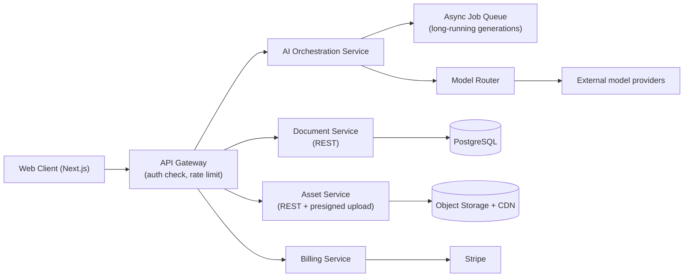

# TASMIM Phase 1 Engineering Specification

> Production-level specification for the Phase 1 MVP scope defined in [`04-feature-prioritization-framework.md`](./04-feature-prioritization-framework.md) — Tier A only. This document specifies; it does not implement. Where Phase 2's Master Architecture describes the full long-term system, this document deliberately narrows it to what Phase 1 actually needs, and calls out explicitly where that means *not* building something the long-term architecture eventually wants.

**Scope guardrail:** Phase 1 is web-only, single-player (no real-time collaboration), three AI agents, one language pair (Arabic/English). Every design decision below optimizes for that scope — building the full cross-platform, ten-agent, real-time-collaborative system now would contradict the sequencing discipline established in the Feature Prioritization Framework.

---

## 1. User Flows

### 1.1 Onboarding
`Landing page → sign up (email or Google/Apple) → email verification → "What are you creating?" prompt → first design (see 1.2) → account fully created in background, no separate setup wizard blocking creation.`

Account creation is deliberately deferred behind the creative moment, not in front of it — a user should be able to see a real result before being asked to commit to an account, converting to a saved account only at the export/save step if they arrived unauthenticated.

### 1.2 The 30-Second Path (primary flow)
1. User enters a prompt or taps a template category (including Islamic event categories, surfaced as first-class options, not buried).
2. AI Designer returns 2–3 distinct draft directions (target: <15s to first render).
3. User selects a draft → opens fully editable in the canvas, pre-populated with their content or matched placeholder content.
4. User edits directly on canvas (drag, type, resize) — AI Layout/Typography Experts offer inline, non-blocking suggestions.
5. Export (single default action: web-ready PNG at native size) or Save (auto-saves continuously regardless).

### 1.3 Manual Creation Flow
`Blank canvas → add elements (text, shape, image, upload) → AI suggestions available on-demand via command palette or contextual toolbar, never forced.`

### 1.4 Template Browsing Flow
`Template gallery (filterable by category, including Islamic events/Hijri-aware seasonal surfacing) → preview → "Use this template" → opens pre-populated in canvas.`

### 1.5 Export Flow
`Canvas → Export action → format selection (PNG/JPG/PDF for Phase 1; no video/CMYK yet, per Tier A scope) → resolution selection → download or copy link.`

### 1.6 Account & Billing Flow (minimal Phase 1 scope)
`Account settings → plan view (Free/Pro) → upgrade → payment (Stripe-hosted checkout, no custom PCI-scope handling) → plan reflected immediately.` Team workspaces, roles, and brand-lock governance are explicitly Tier B/C — Phase 1 is single-user-owned workspaces only.

---

## 2. Information Architecture

```
Account
 └── Workspace (1 per user in Phase 1 — multi-member workspaces are Tier B)
      ├── Projects (optional grouping folder)
      │    └── Documents
      │         └── Pages/Artboards
      │              └── Objects (text, shape, image, group)
      ├── Uploaded Assets (images, logos)
      └── Recent AI Generations (with provenance metadata)

Global (not workspace-scoped)
 ├── Template Library (curated, categorized — including Islamic Suite categories)
 └── Font Library (licensed Latin + Arabic families)
```

Top-level navigation is deliberately shallow per the Experience Design System's "canvas is the app" principle: Home (recent + templates), the active Document (canvas), and Account — no deep sidebar tree.

---

## 3. Database Architecture

**Primary store: PostgreSQL.** Relational integrity for account, billing, and metadata entities; JSONB columns for semi-structured document content, since Phase 1 has no real-time CRDT requirement (Tier B) and a simpler snapshot model is sufficient and considerably less risky to build first.

**Core schema (illustrative, not exhaustive):**

```
users            (id, email, auth_provider, created_at, plan_tier)
workspaces       (id, owner_user_id, name, created_at)
documents        (id, workspace_id, title, current_version_id, created_at, updated_at)
document_versions(id, document_id, content_jsonb, created_at, created_by)
assets           (id, workspace_id, storage_url, type, width, height, created_at)
templates        (id, category, locale_tags[], content_jsonb, is_islamic_suite bool, published_at)
ai_generations   (id, document_id, user_id, agent, prompt, model_used, provenance_jsonb, created_at)
subscriptions    (id, user_id, plan, stripe_customer_id, status, renews_at)
```

**Why a version-snapshot model over an operation log in Phase 1:** the Master Architecture's CRDT operation log (Phase 2/3) is the right long-term model for real-time collaboration, but it is materially more complex to build and debug correctly than periodic content snapshots. Phase 1 has no multiplayer requirement, so a `document_versions` table with periodic snapshots (undo history via version rows) delivers reliable undo/history without that complexity — and the JSONB content shape is designed to be migratable into a CRDT structure later rather than requiring a rewrite.

**Search:** Postgres full-text search is sufficient for Phase 1's template/asset catalog scale; the dedicated vector-search infrastructure (Master Architecture §5) is deferred to when the Inspiration Ecosystem (Tier C) is actually built.

---

## 4. API Architecture



- **Style:** versioned REST (`/v1/...`) over GraphQL for Phase 1 — fewer moving parts, easier to secure and rate-limit, and the client's data needs in Phase 1 are simple enough that GraphQL's flexibility isn't yet earning its complexity cost.
- **Synchronous vs. async AI calls:** fast operations (layout/typography suggestions) are synchronous, sub-2s-target REST calls; the AI Designer's multi-draft generation is a short-polling or Server-Sent-Events-streamed job, since a hard 15-second target (per the 30-second path) benefits from progressive result delivery rather than a single blocking call.
- **No public third-party API in Phase 1** — the plugin/developer ecosystem (Master Architecture §3) is explicitly Tier C; the internal API is versioned and documented from day one specifically so it *can* be opened later without a breaking redesign, but it is not exposed externally yet.

---

## 5. Authentication

- **Method:** OIDC-based auth via a managed identity provider (e.g., Auth0/Clerk-class service) rather than a hand-rolled auth system — authentication is a solved, high-liability problem not worth custom-building at Phase 1 stage.
- **Supported methods:** email/password (with mandatory verification) and Google/Apple social sign-in — covering the large majority of Phase 1's target users without building a broader SSO matrix (SAML/enterprise SSO is explicitly Tier C, tied to the Enterprise phase).
- **Session model:** short-lived JWT access tokens plus a refresh token in an HttpOnly, Secure, SameSite cookie — standard, well-understood token hygiene rather than a novel session scheme.
- **Rate limiting:** login and password-reset endpoints are rate-limited and monitored for credential-stuffing patterns from day one — this is a security floor, not an optional hardening pass.

---

## 6. Storage

- **Object storage** (S3-compatible) for uploaded assets, exported files, and template preview renders, fronted by a CDN for read paths.
- **Access pattern:** clients upload directly to object storage via short-lived presigned URLs (not proxied through the API servers) to keep upload bandwidth off the application tier.
- **Retention:** exported files retained per the user's plan tier; document version snapshots retained per a defined history depth (e.g., last N versions + daily snapshots) rather than an unbounded operation log, consistent with the Section 3 database decision.
- **Backups:** automated daily database backups with point-in-time recovery; object storage versioning enabled on asset buckets as a safety net against accidental overwrite/delete.

---

## 7. Rendering Engine (Phase 1 scope decision)

The Master Architecture (Phase 2) specifies a shared C++/Rust rendering core compiled across web (WebGPU/WASM), desktop (native GPU), and mobile — the right long-term architecture for guaranteed cross-platform fidelity. **Building that full cross-platform core is explicitly not a Phase 1 requirement**, because Phase 1 is web-only (Feature Prioritization Framework, Tier A).

**Phase 1 decision:** build a well-scoped, web-native scene-graph renderer (TypeScript, Canvas2D/WebGL2) with a clean internal API boundary — object model, transform/layout math, and rendering calls kept in clearly separated modules — specifically so that this web renderer's scene-graph representation can migrate into the shared Rust/WASM core later (Phase 2) without a full rewrite of the document model. This is a deliberate, scoped bet: it avoids sinking Phase 1 timeline into building the full cross-platform engine before it's proven necessary, while not architecting a dead end.

**Performance targets for Phase 1:** 60fps interaction on documents with up to ~1,000 objects (well below the Master Architecture's long-term 10,000-object target, which is appropriate for Phase 1's single-page/template-driven use cases rather than complex multi-artboard professional work).

---

## 8. AI Integration

- **AI Orchestration Service** sits behind the API gateway and implements a minimal version of the Master Architecture's Model Router (§6): route each request to the cheapest capable model tier. Phase 1 needs only two tiers — a fast/cheap model for layout and typography suggestions, and a stronger model for the AI Designer's draft generation — not the full on-device/specialist/foundation three-tier system, which depends on infrastructure (on-device models, many fine-tuned specialists) Phase 1 doesn't have yet.
- **Agents shipped in Phase 1:** AI Designer, AI Layout Expert, AI Typography Expert only, per the Feature Prioritization Framework's Tier A scope — implemented as distinct prompt/logic modules behind one orchestration service, not as seven placeholder agents.
- **Provenance:** every AI-generated element writes a row to `ai_generations` (model used, prompt, timestamp) — the minimal viable version of the Master Architecture's provenance layer, sufficient for Phase 1 transparency and future audit needs without building the full public provenance-ledger concept from the Phase 2 future-facing document yet.
- **Safety:** all AI text/image outputs pass through a content-moderation check before being returned to the client, and Arabic/Islamic-context prompts are checked against a keyword/topic filter that routes anything Mushaf-adjacent to a "not available yet" response rather than attempting ungated generation — consistent with the Islamic Creative Suite's governance requirement, enforced here at the API layer, not left to UI convention alone.

---

## 9. Mobile Architecture (Phase 1 reality)

Per the Feature Prioritization Framework, native iOS/Android apps are Tier B, not Tier A. **Phase 1's mobile answer is a responsive, installable Progressive Web App** — not a native app — built from the same Next.js web client with:
- Fully responsive canvas and toolbar layouts down to phone viewport widths.
- Add-to-homescreen support and a basic offline app-shell cache (static assets only — full offline document editing is explicitly deferred to the Tier B/C CRDT offline architecture).
- Touch-adapted (not touch-native-redesigned) interaction for Phase 1 — the fully gesture-first mobile interaction layer described in the Master Architecture is a native-app-era investment, appropriate once native apps are actually being built.

This is a deliberate, honest scope reduction from the Phase 2 vision, not an oversight — building native apps before the web core and wedge are proven would front-load cost against the sequencing discipline established in the Feature Prioritization Framework.

---

## 10. Web Architecture

- **Frontend:** Next.js (React) — server-rendered marketing/landing/template-gallery pages for SEO and fast first load, client-rendered SPA for the canvas editor itself (full justification in [`06-technology-stack-decision.md`](./06-technology-stack-decision.md)).
- **Deployment:** static/SSR pages served via CDN edge; the editor bundle code-split so the heavy canvas/rendering code only loads when a user actually opens a document.
- **State management:** local component/editor state kept client-side (in-memory scene graph, per Section 7) with periodic autosave to the Document Service rather than a heavier global state library — the editor's own scene graph *is* the state, avoiding a duplicate state-management layer.

---

## 11. Security Architecture

- **Transport:** TLS 1.2+ everywhere, HSTS enabled, no plaintext fallback.
- **AuthZ:** workspace-scoped access control — every document/asset request checks workspace ownership; even though Phase 1 has no team roles yet, the authorization check is written as a role check with a single "owner" role from day one, so team roles (Tier B) extend it rather than requiring a retrofit.
- **Secrets management:** all API keys/credentials (model provider keys, Stripe keys, DB credentials) held in a managed secrets store (cloud KMS/vault), never in source control or plain environment files committed anywhere.
- **Input handling:** all user input (including AI prompts) validated and sanitized server-side; canvas content sanitized on load to prevent stored-XSS via malicious SVG/text content.
- **Edge protection:** basic WAF and rate limiting at the CDN/gateway layer against common abuse patterns (scraping, credential stuffing, generation-endpoint abuse).
- **Data at rest:** database and object storage encryption at rest enabled by default via the cloud provider's managed encryption, not custom-built.
- **Audit logging:** account changes, billing events, and Mushaf-adjacent-content-blocked events are logged from Phase 1 — a small, cheap addition now that avoids a painful retrofit once compliance requirements (Phase 3 Enterprise) arrive.
- **Compliance posture:** GDPR-minimum data handling (data export/delete on request, clear consent for AI training-signal use) from day one; GCC-region data residency (relevant given the Islamic Suite wedge) is explicitly a Phase 3 infrastructure dependency (per the Roadmap), not a Phase 1 requirement, but Phase 1's data model avoids decisions that would make later regional data residency harder to retrofit (e.g., keeping user region as an explicit field from the start).

---

## What This Specification Deliberately Does Not Cover

Real-time collaboration protocol design, the CRDT document format, the full ten-agent orchestration system, the Inspiration Ecosystem's vector-search infrastructure, marketplace payment/licensing flows, and native mobile/desktop app specifications are all out of scope for this document by design — they belong to Phase 2/3 specifications written once Phase 1 is live and has real usage data to design against, per the sequencing argued for throughout this Phase 3 document set.
